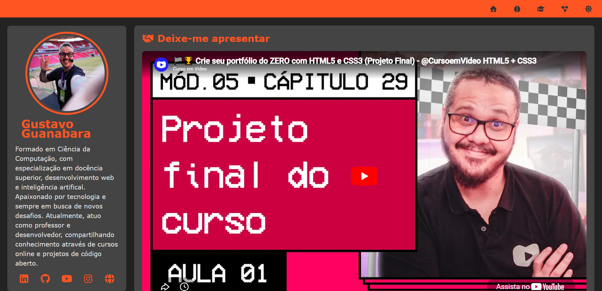
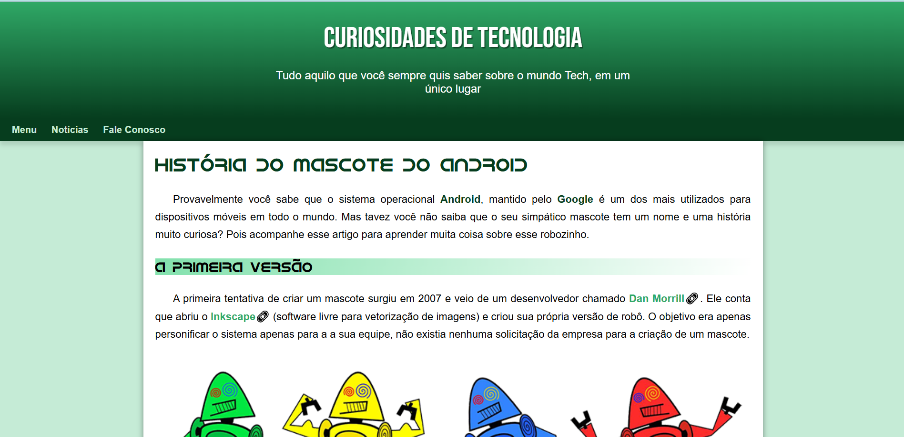
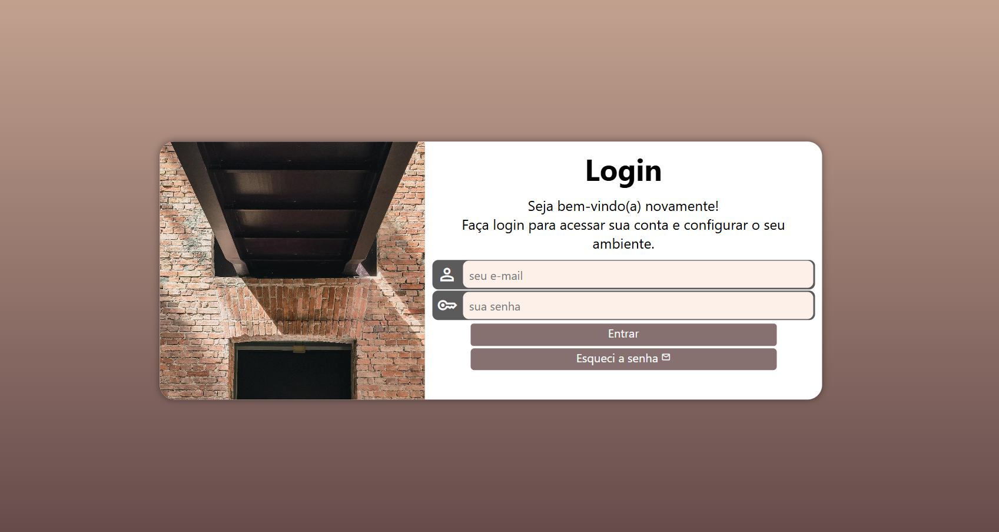

# Olá, eu sou a Dilene 👋

💻 Desenvolvedora full stack em formação  
🚀 Construindo minha jornada na tecnologia através de estudos e  projetos, explorando desenvolvimento web e novas tecnologias  

---

## ✨ Sobre mim

Me formei em Análise e Desenvolvimento de Sistemas, em 2023, e de lá pra cá venho me dedicando através de cursos e capacitações para expandir minhas habilidades. Já atuei na área como Assistente de Suporte, onde pude vivenciar o dia a dia em uma empresa de tecnologia e aprender muito! Lá, também apoiava o time em integrações e no acompanhamento dos projetos.

Atualmente tenho um negócio próprio, a Integral Tech & Geek, que me proporcionou até aqui mais aprendizados, e uma grande bagagem em entendimento de negócio, compromisso e visão estratégica. Paralelamente, sigo com os estudos voltados ao desenvolvimento front-end/ fullstack, buscando sempre evoluir e me tornar uma grande profissional. 

---

## 🚀 Tecnologias e Ferramentas

  
  
  
  
  
  
  

---

<!-- ## 📈 GitHub Stats

---
-->

## 📌 Projetos em destaque

( Em constante construção! ) ✨

Aqui você encontrará projetos desenvolvidos durante meus estudos.

### Portifólio responsivo 

Projeto desenvolvido com HTML, CSS e JavaScript, com abordagem Mobile First, onde foi praticado responsividade, estrutura de múltiplas seções, organização de conteúdo com Grid Layout e Flexbox, além do uso da opção "Modo Escuro". 

🔗 Repositório: [Acesso ao código](https://github.com/dilene-carvalho/estudos/tree/main/projeto-portifolio)

🌐 Acesse online: [Ver Projeto](https://dilene-carvalho.github.io/estudos/projeto-portifolio/)

#### Preview:

---

### Landing Page 

Projeto desenvolvido com HTML e CSS, responsivo para Mobile, onde foi praticado diversos conceitos como Âncoras, Menus, Listas e Abreviações, dentre outros.

🔗 Repositório: [Acesso ao código](https://github.com/dilene-carvalho/estudos/tree/main/desafio_10)

🌐 Acesse online: [Ver Projeto](https://dilene-carvalho.github.io/estudos/desafio_10/)

#### Preview:

--- 

### Tela de Login (UI) 

Projeto de interface de login desenvolvido com HTML e CSS, com foco em estruturação de formulários e layouts de telas de autenticação. 

🔗 Repositório: [Acesso ao código](https://github.com/dilene-carvalho/projeto-login)

🌐 Acesse online: [Ver Projeto](https://dilene-carvalho.github.io/projeto-login/)

#### Preview

<!-- ## 🚀 Eventos, Cursos e Certificações

Aprendizado contínuo em cursos, eventos e imersões voltadas para tecnologia, desenvolvimento e inovação.

📚 
-->
---

## 🌎 Onde me encontrar

  <!-- LinkedIn -->
  

  

  

---

